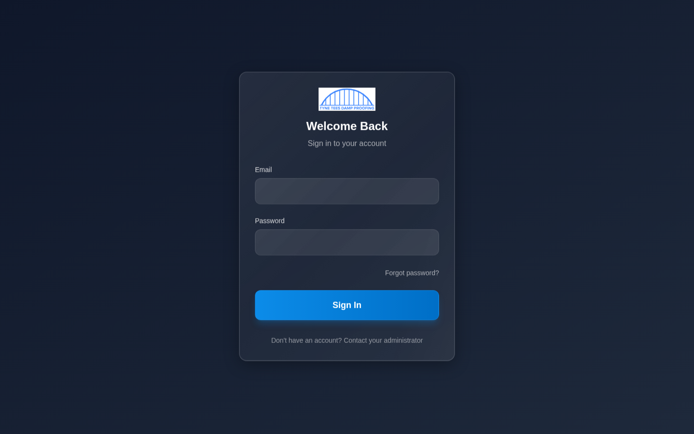
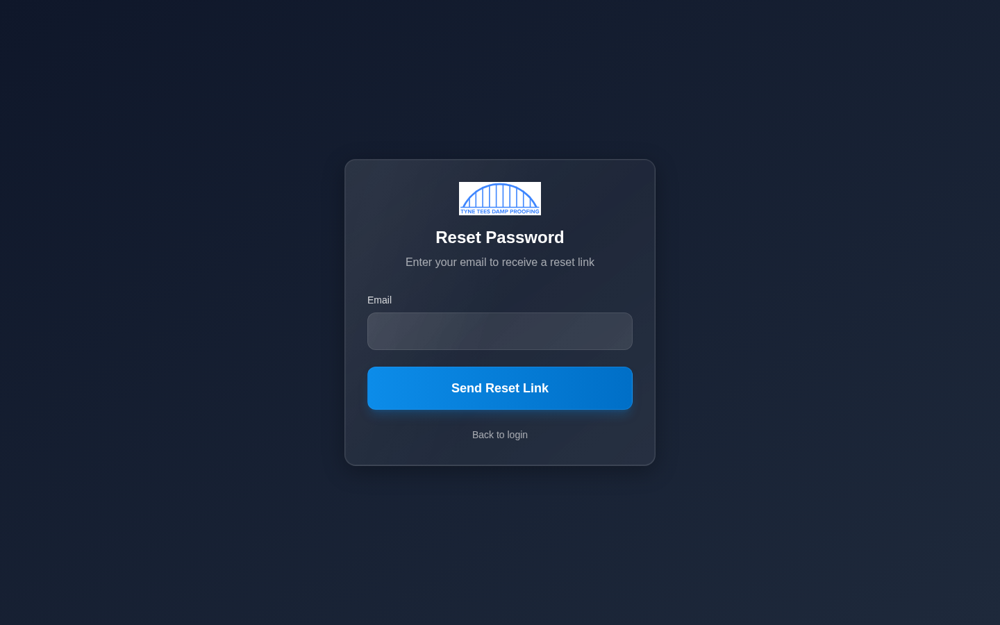
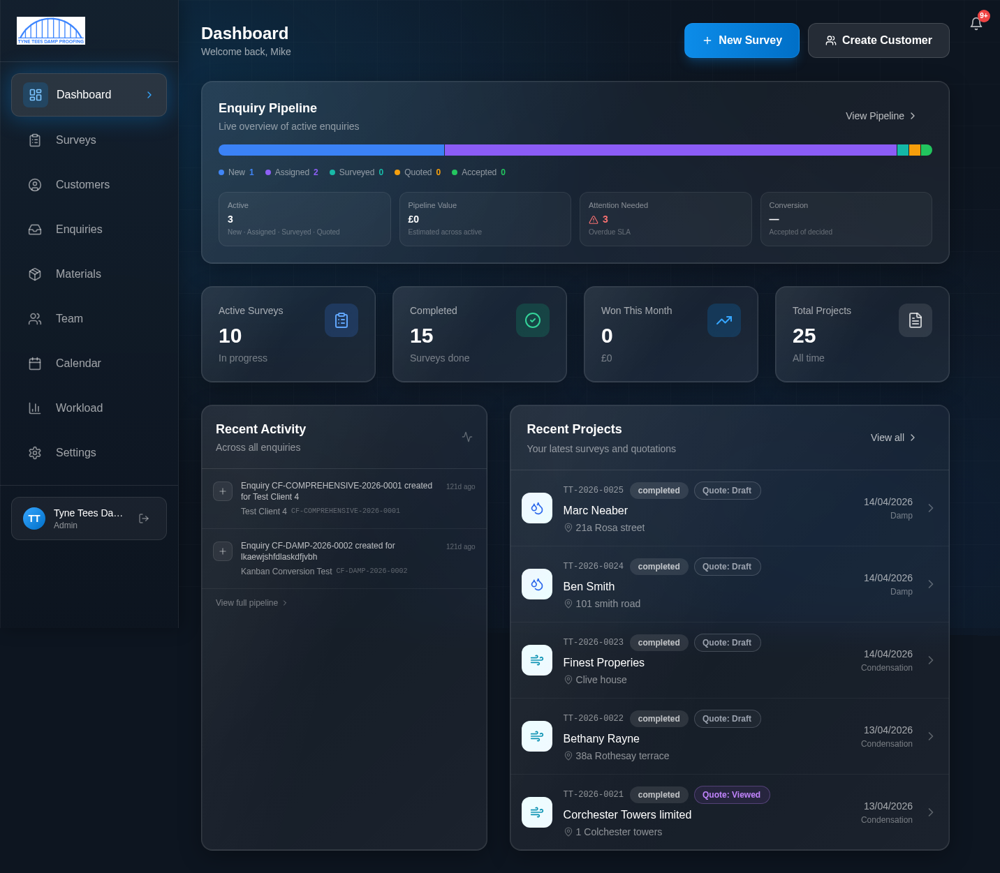
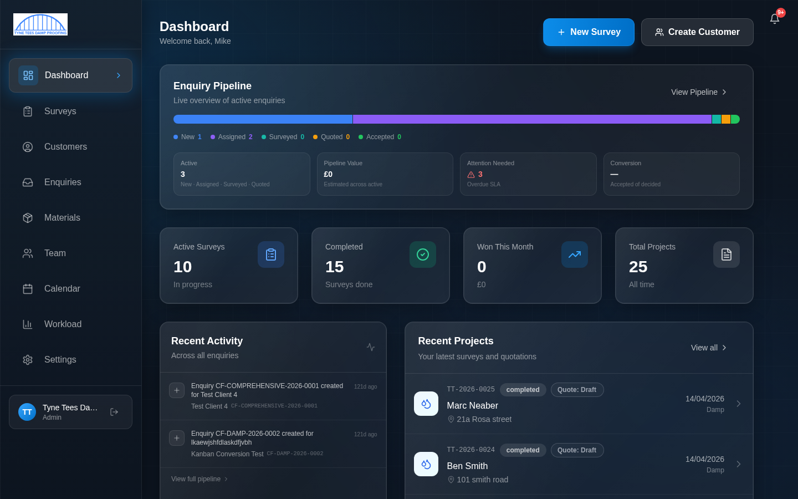

# Getting Started with the TTDP Survey System

**For all staff: Admin, Office, and Surveyors**

Welcome to the Tyne Tees Damp Proofing Survey System. This guide will walk you through your first login, show you how to find your way around, and explain what each part of the screen does. By the end of this guide, you will be comfortable logging in, navigating the system, and understanding your dashboard.

---

## What is the Survey System?

The Survey System is the company's online platform for managing the entire customer journey, from the first phone call through to a completed survey and quotation. It replaces the old paper-based and spreadsheet processes with one central system that everyone in the team uses.

Depending on your role, you will use it to:

- **Office staff** — Log new enquiries, manage the pipeline, book surveys, send quotations and reports
- **Surveyors** — View your daily schedule, carry out surveys on-site using the step-by-step wizard, record findings with photos and voice notes
- **Administrators** — All of the above, plus manage team members, pricing, materials, and company settings

Everything is accessed through a web browser — there is nothing to install. It works on your computer, tablet, or phone.

---

## Logging In

Open your web browser and go to:

**https://ttdp.dc81.io**

You will see the login screen:

1. Type your **email address** in the Email box
2. Type your **password** in the Password box
3. Click the blue **Sign In** button

If your email and password are correct, you will be taken straight to your Dashboard.

> **Don't have an account?** You cannot create your own account. Your administrator will set one up for you and give you your initial login details.

---

## Changing Your Password (First Login)

The first time you log in, the system will ask you to change your password. This is for security — your administrator set a temporary password for you, and you need to choose your own.

1. You will be taken to a **Change Password** screen automatically
2. Type a new password of your choice — make it something memorable but secure
3. Confirm the new password by typing it again
4. Click **Update Password**

You will then be taken to the Dashboard and can start using the system normally.

> **Tip:** Choose a password that is at least 8 characters long and includes a mix of letters and numbers. Write it down somewhere safe if you need to.

---

## Forgot Your Password?

If you forget your password, don't worry — you can reset it yourself.

1. On the login screen, click **Forgot password?** (just below the password box)

2. Enter your email address
3. Click the reset button
4. Check your email inbox for a password reset link
5. Click the link and follow the instructions to set a new password

If you don't receive the email within a few minutes, check your spam/junk folder. If it still doesn't arrive, contact your administrator.

---

## The Dashboard — Your Home Screen

After logging in, you land on the **Dashboard**. This is your home screen and gives you a quick overview of what's happening.

### What Admin and Office Staff See

The dashboard shows:

1. **Welcome message** — "Welcome back, [your name]" at the top
2. **Quick action buttons** — In the top-right corner:
   - **+ New Survey** (blue button) — Start a new survey
   - **Create Customer** — Add a new customer to the system
3. **Enquiry Pipeline summary** — A coloured bar showing how many enquiries are at each stage (New, Assigned, Surveyed, Quoted, Accepted). Click "View Pipeline" to go to the full pipeline board
4. **Key statistics** — Four cards showing:
   - **Active Surveys** — How many surveys are currently in progress
   - **Completed** — Total surveys finished
   - **Won This Month** — Jobs won this month and their value
   - **Total Projects** — All-time total
5. **Recent Activity** — A feed showing the latest things that have happened across all enquiries
6. **Recent Projects** — A list of your most recent surveys with their status, quotation status, date, and type

### What Surveyors See

The surveyor dashboard is simpler — it focuses on what matters to you in the field:

1. **Quick action buttons** — Same as above (+ New Survey, Create Customer)
2. **Key statistics** — The same four stat cards
3. **Recent Projects** — Your recent surveys, taking up the full width of the screen

Surveyors do **not** see the Enquiry Pipeline summary or the Recent Activity feed. These are managed by office staff.

---

## Finding Your Way Around — The Sidebar

On the left side of every screen is the **sidebar menu**. This is how you move between different parts of the system.

The sidebar shows these menu items:

| Menu Item | What it does | Who can see it |
|-----------|-------------|----------------|
| **Dashboard** | Your home screen with stats and recent activity | Everyone |
| **Surveys** | List of all surveys — view, create, or continue | Everyone |
| **Customers** | List of all customers — view, create, or edit | Everyone |
| **Enquiries** | The pipeline board for managing enquiries | Admin and Office only |
| **Materials** | Browse the materials catalogue | Everyone |
| **Team** | View and manage team members | Everyone (editing is Admin only) |
| **Calendar** | Survey bookings calendar | Everyone |
| **Workload** | Surveyor workload dashboard | Admin and Office only |
| **Settings** | System settings and your profile | Everyone |

At the bottom of the sidebar, you can see:
- **Your name and role** — Shows which account you are logged in as
- **Sign out button** — The arrow icon next to your name logs you out

> **Note for surveyors:** You will not see the "Enquiries" or "Workload" items in your sidebar. These are only for office staff and administrators. This is normal — the system only shows you what you need.

---

## The Notification Bell

In the top-right corner of every screen, you will see a **bell icon**. This is your notification centre.

When something important happens that involves you — for example, a new survey is booked for you, or a quotation has been viewed — a red badge will appear on the bell showing how many unread notifications you have.

Click the bell to see your notifications. Each notification shows:
- What happened
- When it happened
- A link to take you to the relevant page

Notifications update in real time — you don't need to refresh the page.

---

## Understanding Your Role

The system has three roles, and your role determines what you can see and do:

### Admin
Full access to everything. Admins can manage team members, set pricing, configure company settings, and do everything that office staff and surveyors can do.

### Office
Access to enquiry management, customer management, the calendar (all surveyors), and the ability to send quotations and reports. Cannot change pricing, manage the team, or access system settings.

### Surveyor
Access to surveys, customers, and your own calendar. You can carry out surveys using the wizard, take photos, record voice notes, and review costings. You cannot access the enquiry pipeline or change system settings.

Your role is shown at the bottom of the sidebar, underneath your name.

---

## Logging Out

To log out of the system:

1. Look at the bottom of the sidebar
2. Find your name and role
3. Click the **sign-out arrow** icon next to your name

You will be returned to the login screen.

> **Tip:** If you're using a shared computer, always log out when you're finished. If you're using your own device, you can stay logged in — the system will keep your session active.

---

## Quick Reference — Keyboard & Browser Tips

- **Going back:** Use your browser's back button, or click the "Back" link at the top of most pages
- **Refreshing:** If something looks stuck, press F5 (or Ctrl+R on Windows, Cmd+R on Mac) to refresh
- **On a phone or tablet:** The sidebar collapses into a menu button — tap it to open the navigation
- **Bookmarking:** You can bookmark https://ttdp.dc81.io in your browser for quick access

---

## What's Next?

Now that you know how to log in and find your way around, read the guide for your specific role:

- **Office Staff** — Read [Office Staff Guide](01-office-staff-guide.md)
- **Surveyors** — Read [Surveyor Guide](02-surveyor-guide.md)
- **Administrators** — Read [Admin Guide](03-admin-guide.md)

If you get stuck at any point, ask your administrator for help. The system is designed to be straightforward — if something doesn't look right, it's more likely a permissions issue (your role doesn't have access) than a problem with the system itself.
