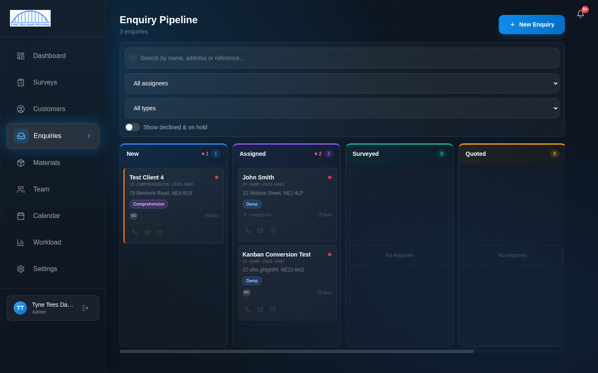
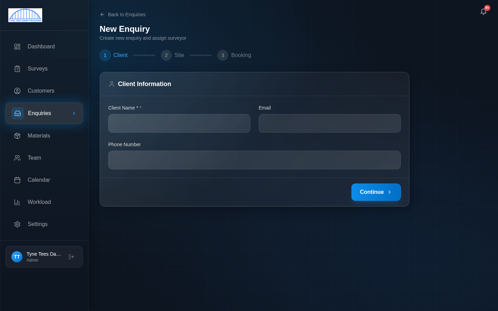
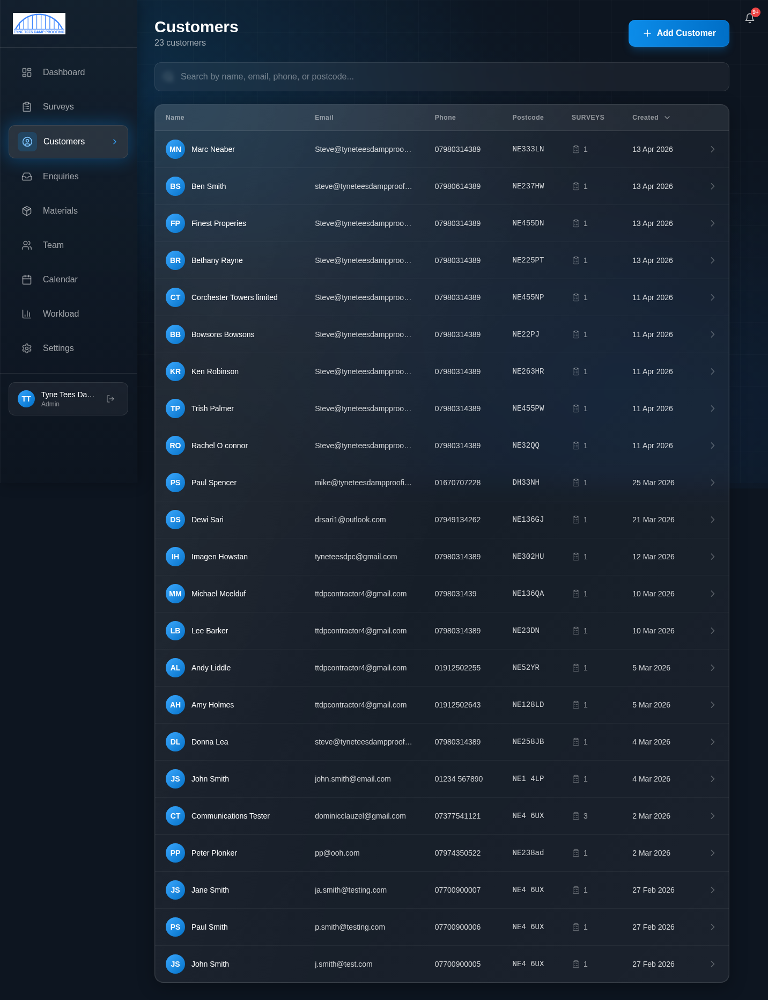
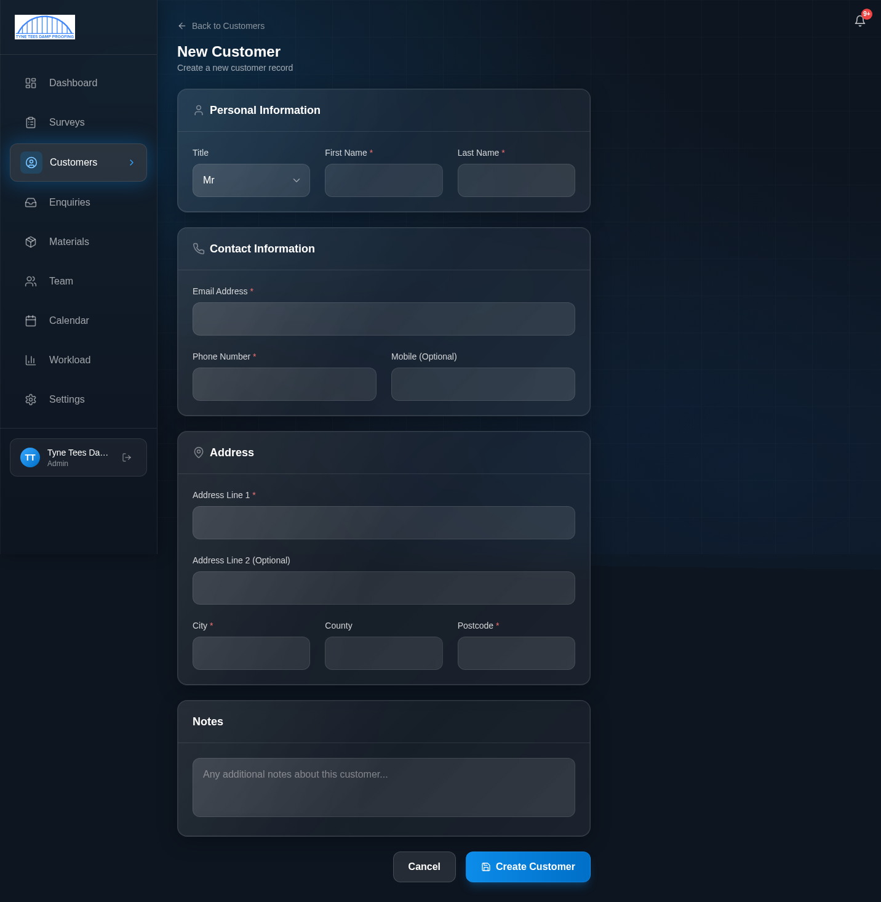
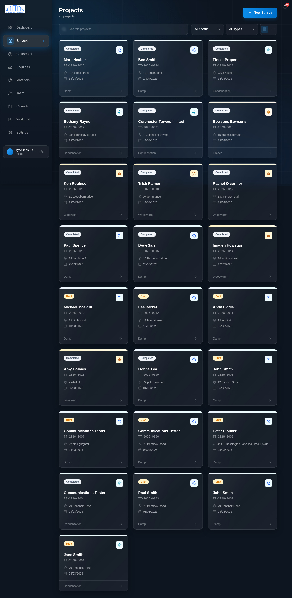
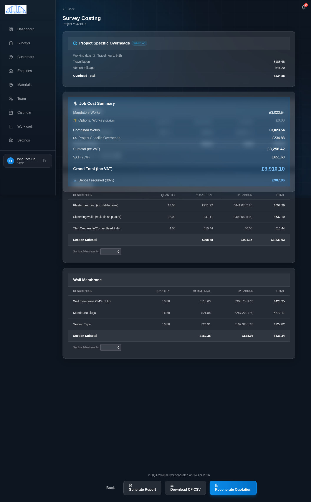
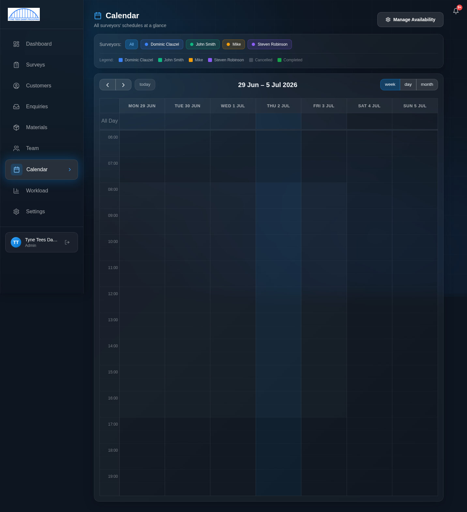

# Office Staff Guide

**For users with the Office or Admin role**

This guide covers everything you need to know to manage the day-to-day running of the business through the survey system. You will learn how to handle enquiries from first contact through to a completed job, manage customers, book surveys, and send quotations and reports.

> **Before reading this guide**, make sure you have completed the [Getting Started](00-getting-started.md) guide and can log in comfortably.

---

## Contents

1. [Your Dashboard](#1-your-dashboard)
2. [The Enquiry Pipeline](#2-the-enquiry-pipeline)
3. [Managing Customers](#3-managing-customers)
4. [The Survey List](#4-the-survey-list)
5. [The Survey Detail Page](#5-the-survey-detail-page)
6. [The Calendar](#6-the-calendar)
7. [Quotations](#7-quotations)
8. [Reports](#8-reports)
9. [Payments](#9-payments)
10. [Quick Reference](#10-quick-reference)

---

## 1. Your Dashboard

When you log in, your dashboard shows you a snapshot of everything at a glance:

### Enquiry Pipeline Summary

At the top of the dashboard is the **Enquiry Pipeline** bar. This is a coloured strip that shows how many enquiries are at each stage:

- **New** (blue) — Enquiries that have just come in and haven't been assigned yet
- **Assigned** (purple) — Assigned to a surveyor but not yet surveyed
- **Surveyed** (green) — Survey completed, waiting for a quotation
- **Quoted** (orange) — Quotation sent to the customer
- **Accepted** (teal) — Customer has accepted the quotation

Below the bar, you'll see four summary cards:
- **Active** — Total active enquiries across all stages
- **Pipeline Value** — Estimated total value of all active enquiries
- **Attention Needed** — Enquiries that are overdue on their SLA (service level agreement)
- **Conversion** — The percentage of enquiries that have converted to accepted jobs

Click **"View Pipeline"** to go to the full Enquiry Pipeline board.

### Key Statistics

Four stat cards below the pipeline:
- **Active Surveys** — Surveys currently in progress
- **Completed** — Total completed surveys
- **Won This Month** — Jobs won this month and their total value
- **Total Projects** — All-time total

### Recent Activity

Shows the latest actions across all enquiries — new enquiries created, status changes, notes added, and so on. This helps you keep track of what's been happening, especially if you've been away.

### Recent Projects

A list of the most recent surveys showing the customer name, address, status, quotation status, date, and survey type. Click any row to open that survey's detail page.

---

## 2. The Enquiry Pipeline

The Enquiry Pipeline is the heart of the office workflow. It's where you track every potential job from the moment a customer calls through to completion.

### Opening the Pipeline

Click **Enquiries** in the sidebar to open the pipeline.

### Understanding the Board

The pipeline is a **Kanban board** — a board with columns, where each column represents a stage in the process. Enquiry cards sit in the column that matches their current stage.

The columns are:

| Column | What it means |
|--------|--------------|
| **New** | A new enquiry has come in — needs to be reviewed and assigned |
| **Assigned** | Assigned to a surveyor — waiting for the survey to happen |
| **Surveyed** | The survey is complete — a quotation needs to be generated and sent |
| **Quoted** | A quotation has been sent to the customer — waiting for their response |
| **Accepted** | The customer has accepted — the job is confirmed |
| **Completed** | The job is fully done (deposit paid) |

There are also **Declined** and **On Hold** statuses, but these are hidden by default. Use the **"Show declined & on hold"** toggle at the top to reveal them.

Each column shows a count badge (e.g. "2") telling you how many enquiries are in that stage.

### Reading an Enquiry Card

Each card on the board shows:
- **Customer name** — In bold at the top
- **Reference number** — e.g. CF-DAMP-2026-0001
- **Address** — The property address
- **Survey type badge** — Colour-coded: Damp, Condensation, Timber, or Woodworm
- **Priority indicator** — A coloured dot (red = urgent, amber = medium, green = low)
- **SLA indicator** — Shows if the enquiry is within or overdue on its target response time
- **Quick action icons** — Small icons at the bottom for phone, email, and other quick actions

### Creating a New Enquiry

When a customer calls or emails to enquire about a survey:

1. Click the **"+ New Enquiry"** button in the top-right corner
2. The New Enquiry form opens with three steps:

**Step 1 — Client:**
- **Client Name** (required) — The customer's name
- **Email** — Their email address
- **Phone Number** — Their phone number
- Click **Continue** to move to the next step

**Step 2 — Site:**
- Enter the **property address** where the survey will take place
- Select the **survey type** (Damp, Condensation, Timber, or Woodworm)
- Add any **notes** about the enquiry
- Click **Continue**

**Step 3 — Booking:**
- Optionally assign a **surveyor** and pick a **date/time**
- Or leave this blank and assign later
- Click **Create Enquiry** to save

The new enquiry will appear in the **New** column on the pipeline board.

### Moving Enquiries Between Columns

You can drag and drop enquiry cards between columns:

1. Click and hold on an enquiry card
2. Drag it to the appropriate column
3. Release to drop it

The system will update the enquiry's status automatically. Some moves will trigger additional actions — for example, moving an enquiry to "Assigned" will ask you to select a surveyor.

> **Tip:** The system also moves cards automatically when certain things happen. For example, when a survey is completed, the enquiry will move to "Surveyed" on its own.

### Opening an Enquiry Detail

Click on any enquiry card to open the **detail drawer** — a panel that slides in from the right side of the screen. The drawer has tabs:

- **Details** — All the enquiry information (customer, address, type, priority, assigned surveyor, dates)
- **Activity** — A timeline of everything that's happened with this enquiry
- **Notes** — Internal notes (only visible to staff, not the customer)

You can edit most fields directly from the drawer — click on a field value to change it.

### Putting an Enquiry On Hold

If a customer asks to delay or you're waiting for information:

1. Open the enquiry
2. Change the status to **On Hold**
3. Select a reason from the template list (or write a custom reason)
4. Optionally send the customer an email explaining the hold

On-hold enquiries are hidden from the main board by default. Toggle "Show declined & on hold" to see them.

### Convert and Book

When you're ready to convert an enquiry into a proper survey booking:

1. Open the enquiry
2. Click **Convert & Book**
3. The system will:
   - Create a **customer record** (if one doesn't exist)
   - Create a **survey** linked to that customer
   - Create a **provisional booking** on the calendar
   - Create a **survey fee payment** record
4. You can then send the customer a payment link for the survey fee

The booking stays **provisional** until the customer pays the survey fee. Once paid, it automatically confirms to **scheduled**.

### Filters and Search

At the top of the pipeline board:
- **Search box** — Search by name, address, or reference number
- **Assignee filter** — Show only enquiries assigned to a specific surveyor
- **Type filter** — Show only a specific survey type (Damp, Condensation, etc.)

---

## 3. Managing Customers

### Viewing the Customer List

Click **Customers** in the sidebar.

The customer list shows all customers in the system, sorted by most recently created. Each row shows:
- **Name** — With coloured initials badge
- **Email**
- **Phone**
- **Postcode**
- **Surveys** — How many surveys this customer has
- **Created** — When the customer was added

Use the **search box** at the top to find a customer by name, email, phone, or postcode.

Click any row to open the **customer detail page**.

### Creating a New Customer

1. Click the **"+ Add Customer"** button in the top-right corner
2. Fill in the form:

**Personal Information:**
- **Title** — Mr, Mrs, Ms, etc. (dropdown)
- **First Name** (required)
- **Last Name** (required)

**Contact Information:**
- **Email Address** (required)
- **Phone Number** (required)
- **Mobile** (optional)

**Address:**
- **Address Line 1** (required)
- **Address Line 2** (optional)
- **City** (required)
- **County**
- **Postcode** (required)

**Notes:**
- Any additional notes about this customer

3. Click **"Create Customer"** to save

> **Tip:** You don't always need to create customers manually. When you use Convert & Book on an enquiry, a customer record is created automatically from the enquiry details.

### Customer Detail Page

Click on any customer in the list to see their full details:

- **Contact information** — Name, email, phone, address
- **Survey history** — All surveys linked to this customer
- **Communication log** — A record of all emails, calls, and messages related to this customer

### Logging a Communication

On the customer detail page, you can log communications manually:

1. Click **"Log Communication"**
2. Select the **channel** — Phone, WhatsApp, In Person, Email, or SMS
3. Add your **notes** about what was discussed
4. Click **Save**

This creates a permanent record that the whole team can see. System-generated communications (like emails sent through the platform) are logged automatically.

---

## 4. The Survey List

Click **Surveys** in the sidebar to see all surveys.

Surveys are shown as **cards** in a grid layout. Each card shows:
- **Customer name**
- **Reference number** (e.g. TT-2026-0025)
- **Address**
- **Status badge** — Completed, In Progress, etc.
- **Survey type** — Damp, Condensation, Timber, or Woodworm
- **Date**

Use the filters at the top to narrow the view:
- **Search** — By customer name or reference
- **Status filter** — All Status, In Progress, Completed, etc.
- **Type filter** — All Types, Damp, Condensation, etc.

Click any survey card to open the **survey detail page**.

---

## 5. The Survey Detail Page

The survey detail page is the central hub for a single survey. Everything related to that survey is accessible from here.

### What You See

- **Header** — Reference number, survey type badge, completion status, and customer name
- **Survey Appointment** — The surveyor assigned, date, time, and booking status
- **Client Details** — Customer name, email, and phone
- **Site Address** — The property address
- **Survey Details** — Inspection date, weather, reference, and report status
- **Notes** — Any internal notes about the survey
- **Quotation** — If a quotation has been generated, it shows the reference, total value, date, and how many times the customer has viewed it

### Action Buttons

At the bottom of the page, you'll see action buttons:

- **Continue Survey** — Opens the survey wizard (the surveyor uses this on-site)
- **View Costing** — See the detailed cost breakdown
- **View Report** — See the generated report
- **Installer Info** — Site information for the installation team

### The Costing Page

Click **View Costing** to see the full cost breakdown for a survey:

The costing page shows:

1. **Project Specific Overheads** — Travel costs, working days, vehicle mileage
2. **Job Cost Summary** — A breakdown of:
   - Mandatory Works total
   - Optional Works total
   - Combined Works total
   - Project Specific Overheads
   - Subtotal (excluding VAT)
   - VAT (20%)
   - **Grand Total (including VAT)**
   - Deposit required (as a percentage)

3. **Section-by-Section Breakdown** — Each section (e.g. Wall Membrane, Replastering) shows:
   - Individual line items with quantities
   - Material costs
   - Labour costs (with hours)
   - Line totals
   - Section subtotal
   - Section Adjustment % (for manual price adjustments)

4. **Action Buttons** at the bottom:
   - **Generate Report** — Creates the AI-generated survey report
   - **Download CF CSV** — Exports the costing data
   - **Regenerate Quotation** — Creates or updates the quotation from the costing

> **Important:** The costing is calculated automatically from the survey data. You don't need to enter costs manually — the system works them out based on the measurements and materials recorded during the survey.

---

## 6. The Calendar

Click **Calendar** in the sidebar to see the booking calendar.

### What You See

The calendar shows all survey bookings across all surveyors:

- **Surveyor filter buttons** — At the top, click to show/hide individual surveyors or click "All" to see everyone
- **Legend** — Colour-coded by surveyor, with grey for cancelled and green for completed
- **View buttons** — Switch between Week, Day, or Month views
- **Navigation arrows** — Move forward or back through dates
- **Today button** — Jump back to the current date/week

### Booking Status Colours

Bookings appear as coloured blocks on the calendar:
- **Coloured by surveyor** — Each surveyor has their own colour
- **Grey** — Cancelled bookings
- **Green** — Completed bookings

### Viewing a Booking

Click on any booking to open the **booking detail modal**:
- Customer name and contact details
- Property address
- Survey type
- Booking status (Provisional, Scheduled, Completed, etc.)
- Quick action buttons (call, email, get directions)

### Managing Booking Status

From the booking modal, you can:

- **Confirm** a provisional booking → changes status to Scheduled
- **Mark as Paid** → confirms the survey fee payment and moves to Scheduled
- **Reschedule** → Opens the slot picker to choose a new date/time
- **Cancel** → Cancels the booking (with confirmation dialog)
- **Mark as Completed** → Records the survey as done
- **Mark as No Show** → Records that the customer didn't attend

> **Status rules:** Bookings follow a set path. A provisional booking can become scheduled or cancelled. A scheduled booking can become completed, no show, or cancelled. Completed, cancelled, and no show are final — they can't be changed.

### Managing Availability

Click **"Manage Availability"** (top-right of the calendar) to set surveyor availability:
- Set weekly working hours for each surveyor
- Add absence blocks (annual leave, sickness, training)

---

## 7. Quotations

Quotations are generated from survey costings and sent to customers.

### How Quotations Are Created

1. A surveyor completes a survey using the wizard
2. The system calculates the costing automatically
3. From the costing page, click **"Regenerate Quotation"**
4. The system creates a quotation with all the line items, grouped by section

### Viewing a Quotation

From the survey detail page, you'll see the Quotation section showing:
- Reference number (e.g. QT-2026-0032)
- Total value including VAT
- Date generated
- Validity period
- How many times the customer has viewed it

Click **"View Quotation"** to see the full quotation.

### Sending a Quotation to the Customer

1. Open the quotation
2. Click **"Send Quotation"**
3. The system sends an email to the customer with a link to view the quotation online
4. The customer can view the quotation, then **Accept** or **Decline** it directly

When the customer accepts:
- They provide an electronic signature
- A **deposit payment** record is automatically created
- The enquiry moves towards the "Accepted" stage

### Copying the Customer Link

Click **"Copy Customer Link"** on the survey detail page to copy the public quotation URL. You can paste this into a message or email to send to the customer manually.

### Downloading as PDF

Quotations can also be downloaded as PDF documents for printing or email attachment.

---

## 8. Reports

Survey reports are AI-generated documents that summarise the survey findings.

### How Reports Are Created

1. After a survey is completed and the costing is reviewed
2. From the costing page, click **"Generate Report"**
3. The system uses AI to write a professional narrative report based on the survey data
4. The report goes through a status workflow: **Draft → Generated → Reviewed → Finalised → Published**

### Reviewing and Editing a Report

1. From the survey detail page, click **"View Report"**
2. The report editor shows each section:
   - Cover page
   - Executive summary
   - Property details
   - External inspection findings
   - Room-by-room findings
   - Scope of works
   - Treatment methodology
   - About the company
3. Click on any section to edit the text
4. Once you're happy, progress the report through each status stage

### Sending a Report

1. When the report status is **Published**
2. Click **"Send Report"**
3. The customer receives an email with a link to view the report online
4. You can track how many times the customer has viewed it

> **Note:** Customer-facing reports deliberately hide technical measurements (square metres, volumes, etc.). The internal version retains all measurements, but the customer only sees the written descriptions and recommendations.

---

## 9. Payments

The system tracks two types of payment:

### Survey Fee

- Created when you use **Convert & Book** on an enquiry
- The customer receives a payment link by email
- They pay online via the **Pay** page
- Once paid, the provisional booking automatically confirms to "Scheduled"
- If the customer doesn't pay within the expiry period, the provisional booking is automatically cancelled

### Deposit

- Created automatically when a customer **accepts a quotation**
- The deposit amount is calculated as a percentage of the job total (set in pricing configuration)
- Office staff **mark the deposit as paid** manually once received
- When the deposit is marked as paid, the enquiry status updates to "Won" and moves to the Completed column

### Sending a Payment Link

From the survey detail page or the enquiry, click **"Send Payment Link"** to email the customer their survey fee payment link.

### Marking a Payment as Paid

If a customer pays by another method (bank transfer, cash, etc.):
1. Open the booking from the calendar, or find it in the survey detail
2. Click **"Mark as Paid"**
3. The system records the payment and updates the booking status

---

## 10. Quick Reference

### Daily Routine Checklist

1. **Check the Dashboard** — Look at the pipeline summary and recent activity
2. **Review the Pipeline** — Check for new enquiries that need assigning
3. **Check the Calendar** — See today's and tomorrow's bookings
4. **Follow up** — Check for overdue SLAs (red indicators on the pipeline)
5. **Process completed surveys** — Generate quotations and send to customers

### Common Tasks — Where to Find Them

| Task | Where to go |
|------|------------|
| Log a new enquiry | Enquiries → + New Enquiry |
| Add a new customer | Customers → + Add Customer |
| Assign a surveyor to an enquiry | Enquiry card → Detail drawer → Assign |
| Book a survey | Enquiry → Convert & Book |
| See today's bookings | Calendar → Day view |
| Send a quotation | Survey detail → View Quotation → Send |
| Send a report | Survey detail → View Report → Send |
| Mark a payment as received | Calendar → Click booking → Mark as Paid |
| Log a phone call | Customers → Customer detail → Log Communication |
| Search for a customer | Customers → Search box |
| Search for a survey | Surveys → Search box |

### Status Meanings at a Glance

| Status | Meaning |
|--------|---------|
| **New** | Enquiry just received, nobody assigned |
| **Assigned** | Surveyor assigned, survey not yet done |
| **Surveyed** | Survey complete, needs quotation |
| **Quoted** | Quotation sent, waiting for customer |
| **Accepted** | Customer accepted the quotation |
| **Completed** | Deposit paid, job confirmed |
| **On Hold** | Paused — waiting for customer or information |
| **Declined** | Customer said no |

### Booking Status Meanings

| Status | Meaning |
|--------|---------|
| **Provisional** | Booked but waiting for survey fee payment |
| **Scheduled** | Confirmed — survey fee paid, appointment set |
| **Completed** | Survey has been done |
| **No Show** | Customer didn't attend |
| **Cancelled** | Booking was cancelled |
