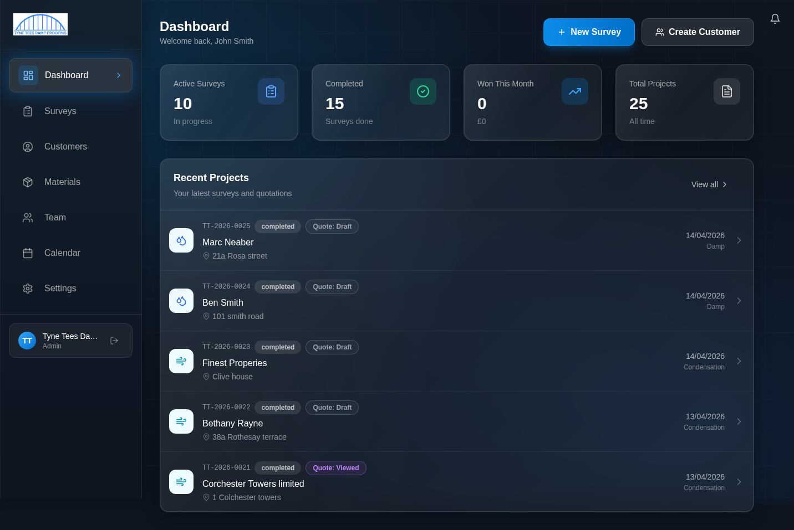
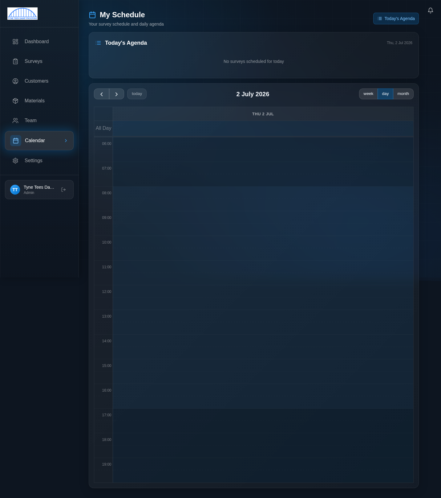
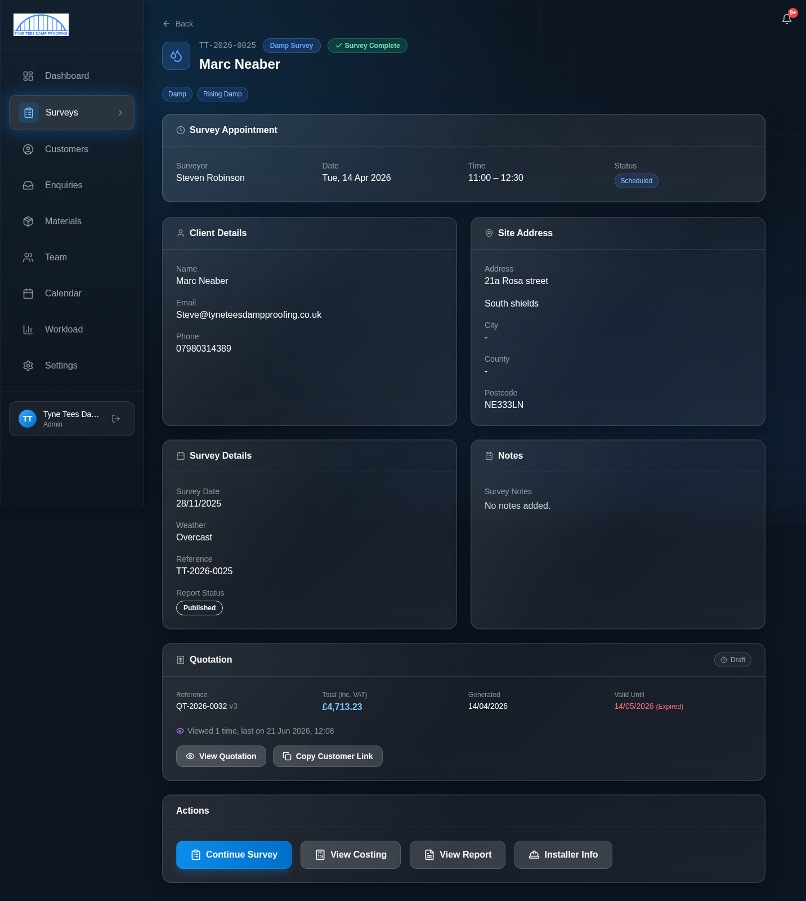
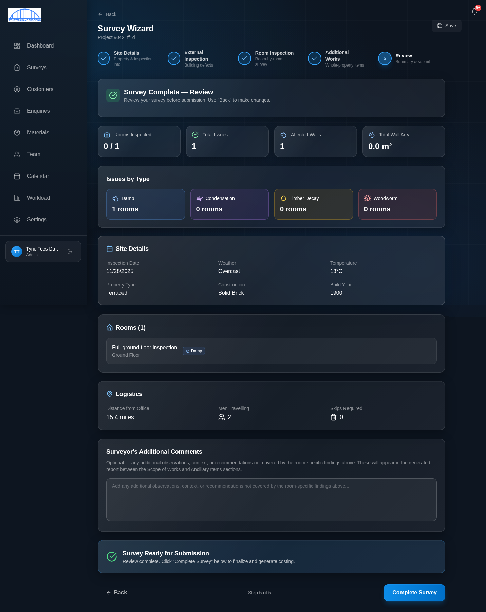
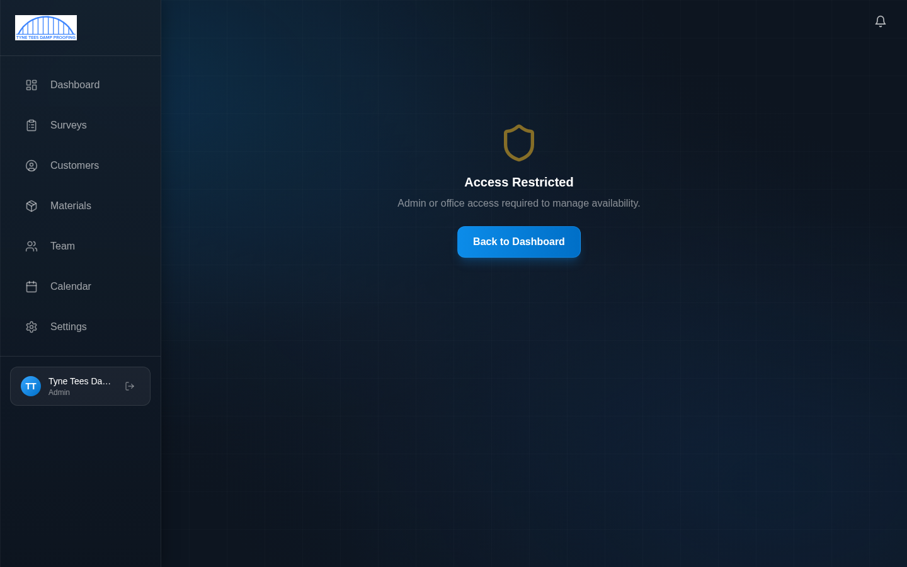

# Surveyor Guide

**For users with the Surveyor role**

This guide covers everything you need as a surveyor. You'll learn how to check your daily schedule, carry out a full survey using the step-by-step wizard on your phone or tablet, record findings with photos and voice notes, and mark surveys as complete.

> **Before reading this guide**, make sure you have completed the [Getting Started](00-getting-started.md) guide and can log in comfortably.

---

## Contents

1. [Your Dashboard](#1-your-dashboard)
2. [Your Daily Schedule](#2-your-daily-schedule)
3. [Before You Leave the Office](#3-before-you-leave-the-office)
4. [Starting a Survey](#4-starting-a-survey)
5. [The Survey Wizard — Step by Step](#5-the-survey-wizard--step-by-step)
6. [Taking Photos](#6-taking-photos)
7. [Using Voice Recording](#7-using-voice-recording)
8. [Saving Your Work](#8-saving-your-work)
9. [Completing the Survey](#9-completing-the-survey)
10. [After the Survey](#10-after-the-survey)
11. [Your Availability](#11-your-availability)
12. [Quick Reference](#12-quick-reference)

---

## 1. Your Dashboard

Your dashboard is your home screen. It shows:

- **Quick action buttons** — "+ New Survey" and "Create Customer" in the top-right
- **Four stat cards** — Active Surveys, Completed, Won This Month, Total Projects
- **Recent Projects** — A list of your most recent surveys, showing the customer name, address, status, quotation status, date, and survey type

Click on any survey in the Recent Projects list to go straight to that survey's detail page.

### What You Won't See

As a surveyor, your dashboard does **not** show the Enquiry Pipeline or the Recent Activity feed. These are managed by the office team. Your sidebar menu also does not include "Enquiries" or "Workload". This is completely normal — the system only shows you what you need for your role.

---

## 2. Your Daily Schedule

Click **Calendar** in the sidebar to see your schedule.

### How Your Calendar Works

Your calendar is different from what the office team sees:

- **It shows only your bookings** — you cannot see other surveyors' schedules
- **It defaults to Day view** — showing today's appointments. You can switch to Week or Month using the buttons in the top-right
- **"Today's Agenda"** — A summary panel at the top showing today's bookings in a simple list format. If you have no surveys today, it will say "No surveys scheduled for today"

### Navigating Dates

- Click the **left/right arrows** to move to the previous or next day
- Click **"today"** to jump back to today
- Use the **week** or **month** buttons to see a wider view

### Viewing a Booking

Click on any booking in the calendar to see its details:
- Customer name and contact details
- Property address
- Survey type
- Time slot
- Quick action buttons — call the customer, get email address, or get directions

### Marking a Survey

From the booking detail, you can:
- **Mark as Completed** — When you've finished the survey on-site
- **Mark as No Show** — If the customer wasn't there

> **Note:** Only office staff can reschedule or cancel bookings. If a survey needs rescheduling, contact the office.

---

## 3. Before You Leave the Office

Before heading out to a survey:

1. **Check your calendar** — Make sure you know the time and address
2. **Open the survey** — From the calendar or from Surveys in the sidebar
3. **Check the customer details** — Name, phone number, and any notes
4. **Make sure your phone/tablet is charged** — You'll need it for the wizard, photos, and voice notes
5. **Check your internet connection** — The system needs an internet connection to save data. Mobile data works fine

---

## 4. Starting a Survey

There are two ways to open a survey:

### From the Calendar
1. Click on the booking in your calendar
2. The booking detail shows the survey information
3. Navigate to the survey detail page

### From the Surveys List
1. Click **Surveys** in the sidebar
2. Find the survey you need (use the search box if needed)
3. Click on the survey card

### The Survey Detail Page

The survey detail page shows everything about a specific survey:

- **Customer and site details** — Name, address, contact info
- **Survey appointment** — Date, time, surveyor, status
- **Survey details** — Inspection date, weather, reference number
- **Notes** — Any notes from the office
- **Quotation** — If one has been generated
- **Action buttons** at the bottom

To start or continue the survey wizard, click the **"Continue Survey"** button.

---

## 5. The Survey Wizard — Step by Step

The survey wizard guides you through the entire on-site inspection in 5 steps. You can see the steps at the top of the screen — each step lights up with a green tick when it's complete.

The five steps are:
1. **Site Details** — Property and inspection information
2. **External Inspection** — Outside of the building
3. **Room Inspection** — Room by room, the main part of the survey
4. **Additional Works** — Whole-property items like ventilation, skips, and travel
5. **Review** — Check everything before submitting

Let's go through each one.

---

### Step 1: Site Details

This step captures basic information about the property and the inspection conditions.

**Property Photo**
- Take a photo of the front of the property (street view)
- This is the first thing you do — tap the camera button and take the photo

**Inspection Information**
- **Inspection Date** — Today's date (auto-filled, but you can change it)
- **Weather Conditions** — Select from the dropdown (Sunny, Cloudy, Overcast, Rain, etc.)
- **Temperature** — Enter the current temperature in degrees Celsius

**Property Details**
- **Property Type** — Select from: Detached House, Semi-Detached, Terrace, Flat, Bungalow, etc.
- **Floor Number** — Only appears if you selected "Flat" — which floor is the flat on?
- **Construction Type** — Select: Solid Brick, Cavity Wall, Stone, Timber Frame, etc.
- **Approximate Build Year** — Type the approximate date, e.g. "1930s" or "Pre-1900"

When you've filled everything in, tap **Next** to move to Step 2.

---

### Step 2: External Inspection

Walk around the outside of the building and record what you find.

**Building Defects**
- Toggle **"Were building defects noted?"** to Yes or No
- If Yes, a checklist of common defects appears — tick each one you can see
- For each defect you tick, you can take up to 2 photos of that specific defect
- Select the **urgency level**: Immediate, Short term (3 months), Medium term (6 months), Long term (12 months)

**Specific Concerns**
- **Wall Tie Concern** — Toggle on if you suspect wall tie issues
- **Cracking Concern** — Toggle on if you notice structural cracking

**External Inspection Observations**
- Type your observations in the text box, or use the **voice recording** button (see [Using Voice Recording](#7-using-voice-recording) below)
- After recording, you can tap **"Polish"** to tidy up the text using AI — it keeps the meaning but makes the language more professional
- If you don't like the polished version, tap **"Undo"** to get your original text back

Tap **Next** to move to Step 3.

---

### Step 3: Room Inspection

This is the main part of the survey. You inspect the property **room by room**.

**Adding a Room**
1. Tap **"Add Room"**
2. Choose from the quick-select list: Living Room, Kitchen, Hallway, Bedroom 1, Bedroom 2, Bedroom 3, Bathroom, Dining Room, Study, Basement, Utility Room, Landing
3. Or type a custom room name
4. Select the **floor level**: Ground, 1st, 2nd, 3rd, 4th+

Each room you add appears as a tab at the top. Tap between tabs to switch rooms.

**For Each Room**

Once you're in a room, work through these sections:

1. **Room ID Photo** — Take a photo showing the room (helps identify which room this is later)

2. **Relative Humidity** — Enter the RH reading (0-100%) if you have a hygrometer

3. **Issues Identified** — This is the key part. Tick which issues you've found in this room:
   - **Damp** (blue water droplet icon)
   - **Condensation** (grey wind icon)
   - **Timber Decay** (brown tree icon)
   - **Woodworm** (red bug icon)

   You can tick multiple issues — a room might have both damp and timber decay, for example. Only tick what you actually find.

4. **Room Observations** — Type or voice-record your findings for this room. Use the Polish button to clean up voice transcriptions.

5. **Defect Evidence Photos** — Take photos of the problems you've found (up to 15 per room). Add a short description of each photo, e.g. "Left wall below window — rising damp staining to 1m height"

6. **Issue-Specific Fields** — Based on which issues you ticked, extra sections appear:

#### If You Ticked "Damp"

You'll see fields for:
- **Affected Walls** — Add each affected wall with its name, length, height, moisture readings, and details like radiator count, socket count, and whether wallpaper is present
- **DPC Treatment** — Is a damp proof course needed? If yes, choose Traditional or Digital, and enter the wall length and depth
- **Wall Treatment** — Choose Membrane, Tanking, or None:
  - For Membrane: select the height (1m, 1.2m, or 2m) and enter wall lengths
  - For Tanking: enter the area in square metres
- **Strip-Out** — Areas of plaster, stud walls, or ceilings to remove
- **Floor Treatment** — Choose Resin Membrane, New Joists, or None, with area measurements
- **Plastering** — Areas for stud walls, plasterboard, and skim coat

#### If You Ticked "Condensation"

You'll see:
- **Evidence** — Toggle on/off: condensation on windows, black mould present (with severity: light/moderate/severe), ventilation adequate
- **Humidity Reading** — Enter the RH percentage
- **Extraction** — Is extraction needed? Choose Passive or Active ventilation:
  - Passive: how many passive vents and core holes
  - Active: how many fans, electrical packs, grilles

#### If You Ticked "Timber Decay"

You'll see:
- **Floor Inspection** — Floor type, condition, access level, sub-floor ventilation
- **Fungal Findings** — Select from: None, Dry Rot, Wet Rot, Cellar Fungus, White Pore Fungus (multiple can be selected). Enter the treatment area
- **Timber Replacement** — Toggle on if joists or flooring need replacing. Enter joist sizes, quantities, lengths, and flooring type and area. Includes accessories like endwrap, wall plates, and insulation
- **Masonry Preparation** — Areas for debris clearance, mortar grinding, wire scrubbing, sterilant, and protective treatment

#### If You Ticked "Woodworm"

You'll see:
- **Infestation Details** — Species (Common Furniture Beetle, Deathwatch Beetle, etc.), status (Active, Historic, Uncertain), severity (Light, Moderate, Severe), and whether there's structural damage
- **Treatment Areas** — Spray floor area, spray timber area, paste treatment area
- **Fogging** — Loft insulation area (with options for lifting and relaying insulation), staircase step counts

**Marking a Room Complete**
When you've finished inspecting a room, tap the **"Mark Complete"** checkbox at the top of the room. A green tick will appear on that room's tab.

**Deleting a Room**
If you added a room by mistake, tap the **delete button** on the room and confirm. Be careful — this removes all the data for that room.

> **Important:** You must add and complete at least 1 room before you can move to Step 4. The system will not let you proceed with zero rooms.

Tap **Next** to move to Step 4.

---

### Step 4: Additional Works

This step covers whole-property items that don't belong to a specific room.

**Condensation Equipment** (only appears if you identified condensation in any room)
- Is a PIV (Positive Input Ventilation) unit recommended?
- If yes, choose the type (Loft Heated, Loft Unheated, or Wall Mounted) and enter quantities for units, electrical packs, and related components
- For loft-mounted PIV, you can also note if a new loft hatch and ladder is needed

**Floor Protection**
- How many Antinox HD floor protection boards are needed? (each board is 2.4m x 1.2m)

**Plastering Extras**
- Stop beads, corner beads, and difficulty hours for plastering work

**Airbricks**
- How many to clean, upgrade, or install new

**Spray Treatment**
- Total spray treatment area and difficulty hours

**Optional Items**
- ACO drains, French drains, Aquaban, asbestos tests — these are items the customer can choose whether to include

**Waste & Logistics** (required)
- **Skip Count** — How many skips are needed
- **Distance from Office** — How far is this property from the office (in miles)
- **Men Travelling** — How many people are travelling to the site

Tap **Next** to move to Step 5.

---

### Step 5: Review

The Review step shows you everything you've recorded across all the previous steps. This is your chance to check the data before submitting.

The review shows:
- **Summary cards** — Rooms inspected, total issues, affected walls, total wall area
- **Issues by Type** — How many rooms had each issue (Damp, Condensation, Timber, Woodworm)
- **Site Details** — Inspection date, weather, temperature, property type, construction, build year
- **External Inspection** — Defects found, concerns noted
- **Room List** — Each room with its issues and completion status
- **Logistics** — Distance, men travelling, skips required
- **Surveyor's Additional Comments** — A text box where you can add any extra notes or observations that don't fit elsewhere. These will appear in the generated report

If anything looks wrong, tap **"Back"** to go back to the relevant step and fix it.

When everything looks right, tap the **"Complete Survey"** button.

---

## 6. Taking Photos

Photos are a crucial part of the survey. The system makes it easy to take and organise them.

### How to Take a Photo

Whenever you see a camera button or a "Take Photo" option:

1. Tap the camera button
2. Your phone's camera will open — take the photo
3. Add a short **description** of what the photo shows (e.g. "Damp staining on north wall, below window")
4. The photo is uploaded and attached to the right part of the survey

### Tips for Good Photos

- **Get close enough** to show the problem clearly
- **Include context** — show enough of the wall/floor/ceiling so someone can identify the location
- **Take photos in good light** — use your phone's flash if needed
- **Describe each photo** — the description helps the report writer understand what they're looking at

### Photo Limits

- Street view photo: 1 per survey (Step 1)
- Defect photos on external inspection: 2 per defect (Step 2)
- Room ID photo: 1 per room (Step 3)
- Defect evidence photos: up to 15 per room (Step 3)

### Upload Issues

If a photo fails to upload (poor signal, for example):
- The system will automatically retry up to 2 times
- You'll see a progress indicator while it's uploading
- If it still fails, try again when you have a better connection — the rest of your survey data is saved separately

> **Supported formats:** JPG, PNG, or WebP. Maximum file size: 15MB per photo.

---

## 7. Using Voice Recording

Instead of typing observations, you can speak them. This is especially useful on-site when your hands are busy or when you want to record detailed observations quickly.

### How to Record

1. Find the **"Record Voice Note"** button (it appears in the observations text box areas on Steps 2 and 3)
2. Tap the button — recording starts immediately
3. **Speak clearly** and describe what you see
4. You can record for up to **2 minutes** per clip
5. Tap **"Stop"** when finished
6. The system transcribes your speech into text and adds it to the observations box

### After Recording

- **Read the transcription** — check it makes sense. Voice-to-text isn't perfect, especially with technical terms
- **Tap "Polish"** — the AI will clean up the text, fixing grammar and making it sound more professional while keeping the meaning the same
- **Tap "Undo"** — if the polished version changed something you didn't want changed, tap Undo to get the original transcription back
- You can always edit the text manually as well

### Tips for Voice Recording

- Speak at a normal pace — rushing makes transcription less accurate
- Say full sentences — "There is rising damp on the north wall to a height of approximately one metre" works better than "north wall, damp, one metre"
- Avoid background noise if possible — the system has noise suppression, but a quiet environment helps
- Your phone screen will stay on during recording (the system prevents it from sleeping)

---

## 8. Saving Your Work

The survey wizard **auto-saves** your work as you go. You do not need to manually save.

### How Auto-Save Works

- Every time you move between steps (Next or Back), your data is saved
- Every time you add or complete a room, your data is saved
- Photos are uploaded individually as you take them
- If you lose your internet connection temporarily, the data will save when you reconnect

### Leaving and Coming Back

You can close the browser or leave the wizard at any time. When you come back:
1. Go to the survey (from your calendar, surveys list, or dashboard)
2. Click **"Continue Survey"**
3. You'll be taken back to where you left off, with all your previous data intact

### The Save Button

There's also a manual **"Save"** button in the top-right corner of the wizard. You can tap this at any time for peace of mind, but it's not strictly necessary — the auto-save handles it.

---

## 9. Completing the Survey

When you've finished all 5 steps and reviewed your data:

1. On the Review step (Step 5), check that:
   - All rooms are marked as complete (green ticks)
   - The summary data looks correct
   - You've added any additional comments
2. Tap **"Complete Survey"**
3. The system will:
   - Save all your data
   - Calculate the costing automatically (based on everything you recorded)
   - Mark the survey status as "Completed"

### What Happens Next

After you complete the survey:
- The office team will see the completed survey with its calculated costing
- They can generate a quotation and report from the costing data
- You can still view the survey and its costing, but you typically won't need to make changes

### Marking the Booking

Don't forget to also mark the booking as complete in your calendar:
1. Go to **Calendar**
2. Tap on today's booking
3. Tap **"Mark as Completed"**

---

## 10. After the Survey

### Viewing Your Completed Surveys

Click **Surveys** in the sidebar to see all your surveys. You can filter by status to see only completed ones.

### Viewing the Costing

From any survey's detail page, click **"View Costing"** to see the cost breakdown that the system calculated from your data. This shows:
- Overhead costs (travel, vehicle mileage)
- Material costs for every item
- Labour costs
- Section subtotals
- Grand total with VAT

> **Note:** You don't need to enter any costs — the system works them out automatically from the measurements and materials you recorded. If something looks wrong with the costing, speak to the office team.

### Installer Information

Click **"Installer Info"** on the survey detail page to add site information that the installation team will need:
- Access notes
- Special requirements
- Site photos for the installation crew

---

## 11. Your Availability

Click **Calendar** in the sidebar, or navigate to your availability settings to manage when you're available for surveys.

### What You Can Do

- **View your weekly hours** — See what hours are set for each day of the week (these are set by the admin)
- **Add absence blocks** — Book time off:
  - **Annual Leave** — Holiday
  - **Sickness** — Sick days
  - **Training** — Training courses
  - **Other** — Any other reason

### Adding an Absence Block

1. Go to your availability page
2. Click **"Add Absence"** or similar
3. Select the type (Annual Leave, Sickness, Training, Other)
4. Choose the start and end dates
5. Add a note if needed
6. Save

The office team and admin can see your absence blocks and won't book surveys during those periods.

> **Note:** You cannot change your own weekly working hours — this is managed by the administrator. If your regular hours need changing, speak to your admin.

---

## 12. Quick Reference

### Your Daily Routine

1. **Log in** and check your **Dashboard** for any updates
2. Open the **Calendar** to see today's appointments
3. For each survey:
   - Check the customer and site details before leaving
   - On-site: open the survey wizard and work through all 5 steps
   - Take photos at every opportunity
   - Use voice recording for detailed observations
   - Complete the survey wizard
   - Mark the booking as completed in your calendar
4. **Log out** when you're done for the day

### The 5 Wizard Steps at a Glance

| Step | Name | What You Do |
|------|------|-------------|
| 1 | Site Details | Property photo, date, weather, property type, construction |
| 2 | External Inspection | Walk around outside, note defects, take photos, record observations |
| 3 | Room Inspection | Room by room — issues, measurements, photos, observations |
| 4 | Additional Works | Ventilation, skips, travel distance, extras |
| 5 | Review | Check everything, add final comments, complete survey |

### Issue Types Explained

| Issue | Icon | What It Covers |
|-------|------|---------------|
| **Damp** | Water droplet (blue) | Rising damp, penetrating damp — DPC, membranes, tanking, strip-out, plastering |
| **Condensation** | Wind (grey) | Mould, humidity, ventilation — PIV units, fans, passive vents |
| **Timber Decay** | Tree (brown) | Wet rot, dry rot — floor condition, joists, treatment, replacement |
| **Woodworm** | Bug (red) | Beetle infestation — species, severity, spray/paste treatment, fogging |

### Troubleshooting

| Problem | What to Do |
|---------|-----------|
| Can't log in | Check your email and password. Try "Forgot password?" if stuck |
| Photo won't upload | Check your internet connection. The system retries automatically. Try again later |
| Voice recording not working | Make sure you've allowed microphone access in your browser. Check your phone isn't on silent |
| Data seems to have disappeared | Don't panic — it auto-saves. Try refreshing the page (pull down on mobile). Check you're looking at the right survey |
| Can't move to the next step | Check that all required fields are filled in. For Step 3, you need at least 1 room |
| Booking doesn't show in calendar | Check the date — use the navigation arrows. If it's still missing, contact the office |
| Can't see Enquiries in the menu | This is normal — the Enquiries section is only for office staff |
