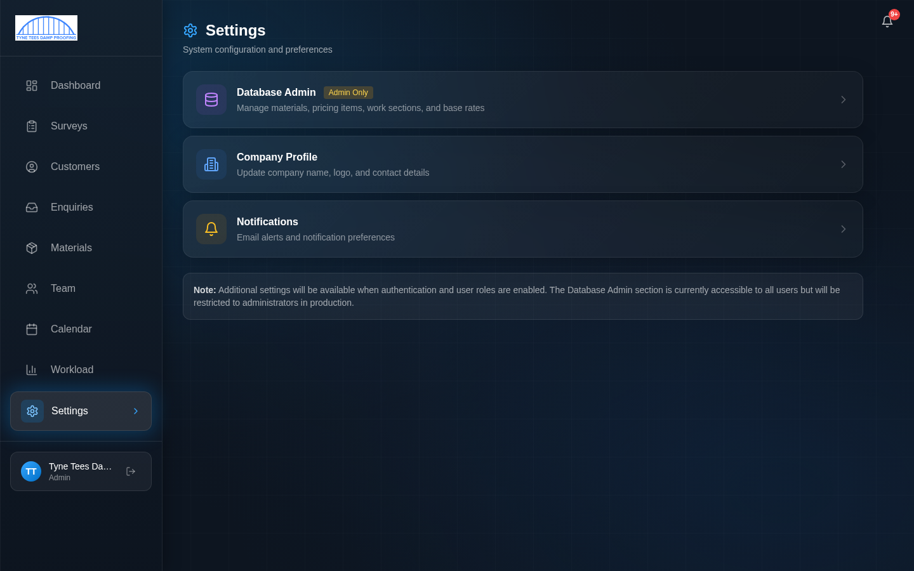
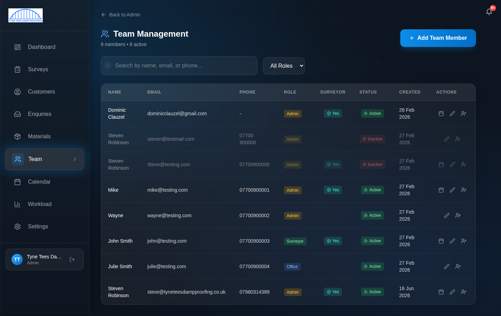
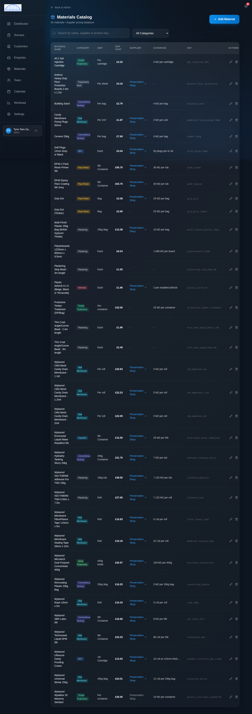
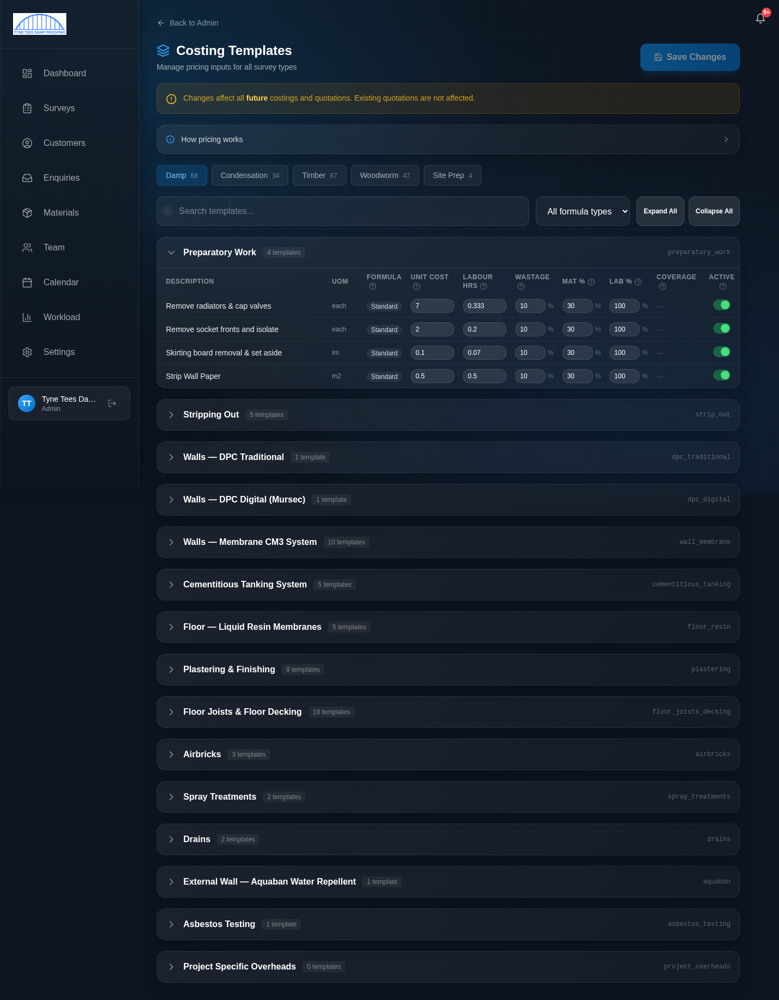
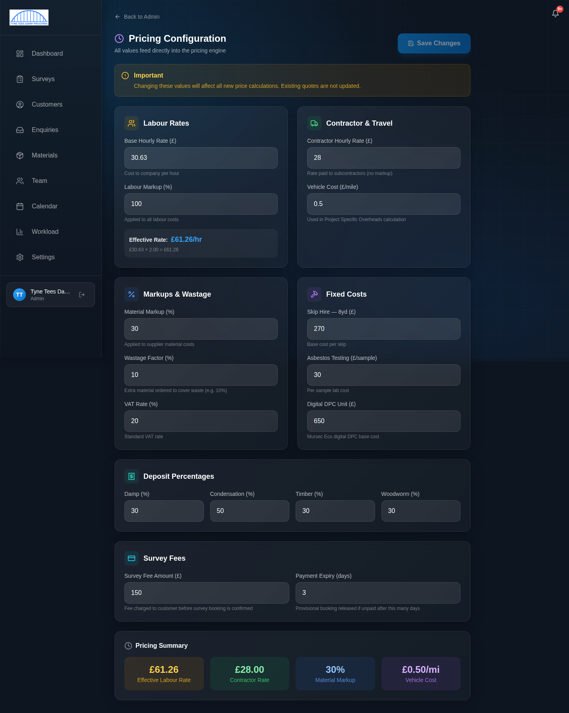
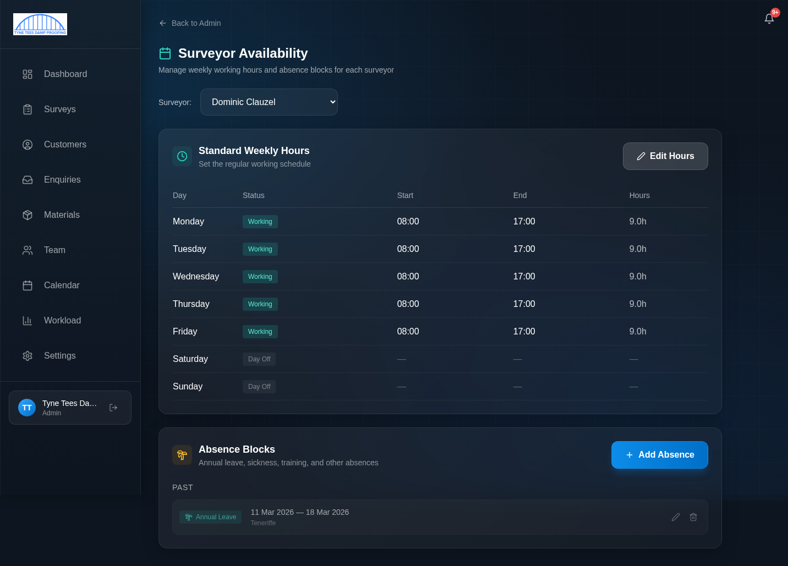
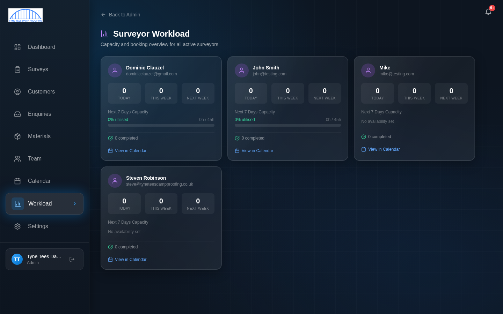
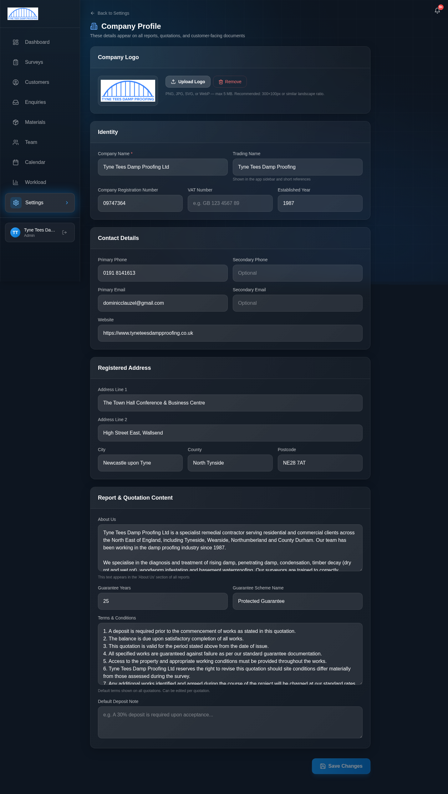
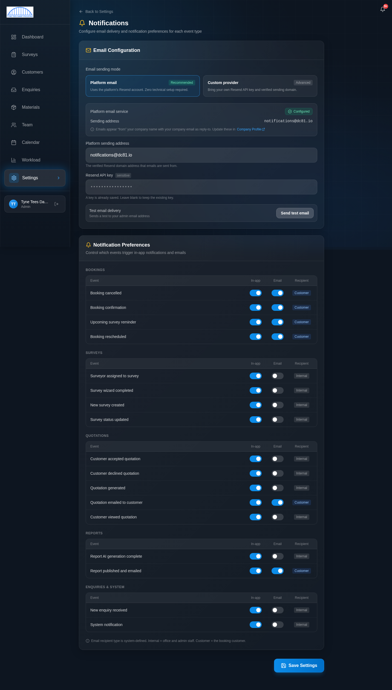

# Administrator Guide

**For users with the Admin role**

This guide covers the system administration features that only administrators can access. As an admin, you have full access to everything in the system — this guide focuses on the admin-only areas: managing the team, configuring pricing, maintaining the materials catalogue, and system settings.

> **Before reading this guide**, make sure you have completed:
> - [Getting Started](00-getting-started.md) — Logging in and navigation
> - [Office Staff Guide](01-office-staff-guide.md) — Enquiries, customers, calendar, quotations, and reports
>
> As an admin, you can do everything office staff can do, plus the admin-only features covered here.

---

## Contents

1. [Admin Overview](#1-admin-overview)
2. [Team Management](#2-team-management)
3. [Materials Catalogue](#3-materials-catalogue)
4. [Costing Templates](#4-costing-templates)
5. [Pricing Configuration](#5-pricing-configuration)
6. [Surveyor Availability](#6-surveyor-availability)
7. [Surveyor Workload](#7-surveyor-workload)
8. [Company Settings](#8-company-settings)
9. [Notification Settings](#9-notification-settings)
10. [Admin Quick Reference](#10-admin-quick-reference)

---

## 1. Admin Overview

As an administrator, you have access to everything in the system. In addition to all the features available to office staff (enquiries, customers, calendar, quotations, reports), you can:

- **Manage the team** — Add, edit, and deactivate team member accounts
- **Control pricing** — Set labour rates, markups, VAT, deposit percentages, and survey fees
- **Manage materials** — Add, edit, and remove products from the materials catalogue
- **Edit costing templates** — Adjust the formulas and parameters that calculate job costs
- **Set availability** — Configure surveyor weekly hours and view absence blocks
- **Configure settings** — Company profile, logo, terms and conditions, notification preferences

### The Settings Hub

Click **Settings** in the sidebar to see the admin settings hub:

From here you can access:
- **Database Admin** (Admin Only) — Materials, pricing, costing sections, and base rates
- **Company Profile** — Company name, logo, and contact details
- **Notifications** — Email and in-app notification preferences

---

## 2. Team Management

Click **Team** in the sidebar to manage user accounts.

### What You See

The team list shows every user account in the system:
- **Name**
- **Email**
- **Phone**
- **Role** — Admin, Office, or Surveyor (colour-coded badge)
- **Surveyor** — Whether this person can be assigned surveys (Yes/No)
- **Status** — Active or Inactive
- **Created** — When the account was set up
- **Actions** — Buttons to edit, reset password, or manage the account

Use the **search box** to find someone by name, email, or phone. Use the **role filter dropdown** to show only accounts with a specific role.

### Adding a New Team Member

1. Click **"+ Add Team Member"** in the top-right corner
2. Fill in the form:
   - **Display Name** — Their name as it will appear throughout the system
   - **Email** — Their login email address (must be unique)
   - **Phone** — Contact number
   - **Role** — Choose one:
     - **Admin** — Full access to everything
     - **Office** — Enquiry management, calendar, quotations, reports
     - **Surveyor** — Survey wizard, own calendar, limited access
   - **Is Surveyor** — Toggle on if this person carries out surveys (this controls whether they appear in the surveyor dropdown when booking). Note: an Admin or Office user can also be flagged as a surveyor if they do both roles
   - **Temporary Password** — Set an initial password for them

3. Click **"Create"**

The new team member will be created with **"Must Change Password"** set — they'll be asked to choose their own password the first time they log in.

### Editing a Team Member

Click the **edit (pencil) icon** next to any team member to change their details:
- Name, email, phone
- Role
- Is Surveyor flag
- Qualifications (for surveyor profiles — shown in reports)

> **Important:** You cannot change your own role. This prevents accidentally locking yourself out of admin access.

### Deactivating an Account

If someone leaves the company or no longer needs access:

1. Click the edit icon next to their name
2. Toggle their status to **Inactive**
3. Save

Deactivated accounts:
- Cannot log in
- Are automatically logged out if currently active
- Keep their historical data (surveys, enquiries, etc.) intact
- Can be reactivated later if needed

> **Important:** You cannot deactivate your own account. This prevents accidentally locking everyone out.

### Resetting a Password

Click the **password reset icon** next to a team member to set a new temporary password for them. They will be required to change it on their next login.

---

## 3. Materials Catalogue

The materials catalogue is the master list of all products used in costings. Every material, membrane, chemical, and sundry item is listed here with its supplier cost, coverage rate, and category.

Click **Materials** in the sidebar to view the catalogue, or go to **Settings → Database Admin** for the full admin view.

### What You See

The admin materials view shows a table with:
- **Material Name** — Product description
- **Category** — What type of product it is (colour-coded badge): DPC, Plastering, Membrane, Condensation, Timber, etc.
- **Unit** — How it's measured (each, per bag, per roll, m2, etc.)
- **Supplier Cost** — What we pay for it
- **Coverage** — How much area one unit covers (e.g. "4.65 per cartridge", "2 m2 per bag")
- **Actions** — Edit or delete

Use the **search box** and **category filter** to find specific materials.

### Adding a New Material

1. Click **"+ Add Material"**
2. Fill in:
   - **Name** — Full product name (be specific, e.g. "Wykamol CM3 Mesh Membrane - 1.2m")
   - **Category** — Select from the list
   - **Unit of Measure** — How this product is sold/measured
   - **Supplier Cost** — The price you pay (excluding VAT)
   - **Coverage Rate** — How much one unit covers (this is used in costing calculations)
   - **Product Key** — An internal reference key used by the costing engine
3. Click **Save**

### Editing a Material

Click the **edit icon** next to any material to change its cost, coverage, or other details. Changes affect all **future** costings — existing quotations are not affected.

### Deleting a Material

Click the **delete icon** to remove a material. Be careful — only delete materials that are no longer used. If a material is referenced by active costing templates, removing it could affect future costing calculations.

> **Tip:** When supplier prices change, update the Supplier Cost here. The next time a survey costing is calculated, it will use the new price automatically.

---

## 4. Costing Templates

Costing templates define how the system calculates job costs. Each template is a line item that specifies a formula type, unit cost, labour hours, markup percentages, and wastage factors.

Navigate to **Settings → Database Admin → Costing Templates**, or click **Admin** in the sidebar area.

### Understanding the Layout

Templates are organised by **survey type** — tabs at the top let you switch between:
- **Damp** (68 templates)
- **Condensation** (34 templates)
- **Timber** (67 templates)
- **Woodworm** (47 templates)
- **Site Prep** (4 templates)

Within each survey type, templates are grouped into **sections** (collapsible):
- Preparatory Work
- Stripping Out
- Walls — DPC Traditional
- Walls — DPC Digital (Mursec)
- Walls — Membrane CM3 System
- Cementitious Tanking System
- Floor — Liquid Resin Membranes
- Plastering & Finishing
- Floor Joists & Floor Decking
- Airbricks
- Spray Treatments
- Drains
- And more...

Click the **arrow** next to a section name to expand or collapse it. Use **"Expand All"** or **"Collapse All"** buttons to open/close everything.

### Reading a Template Row

Each template line shows:

| Column | What it means |
|--------|--------------|
| **Description** | What the line item is (e.g. "Remove radiators & cap valves") |
| **UOM** | Unit of measure (each, m, m2, etc.) |
| **Formula** | Calculation type (Standard, Ceiling Coverage, DPC Injection, etc.) |
| **Unit Cost** | Material cost per unit |
| **Labour Hrs** | Hours of labour per unit |
| **Wastage %** | Extra material ordered to cover waste |
| **Mat %** | Material markup percentage |
| **Lab %** | Labour markup percentage |
| **Coverage** | Coverage rate (for materials that cover an area) |
| **Active** | Green toggle = active (included in costings), grey = inactive |

### Editing a Template

1. Click directly on any number in the table to edit it
2. Change the value
3. Click **"Save Changes"** in the top-right corner

> **Warning:** The yellow banner at the top says: *"Changes affect all future costings and quotations. Existing quotations are not affected."* So you can update prices without worrying about changing quotes that have already been sent.

### Activating/Deactivating Templates

Toggle the **Active** switch on any line to include or exclude it from costings. Inactive templates are greyed out and won't appear in future costing calculations.

### Formula Types

The system uses 11 different formula types to calculate costs. Most are "Standard" (simple quantity x cost), but some are specialised:

| Formula | Used For |
|---------|---------|
| Standard | Most items — quantity x unit cost for materials, quantity x hours x rate for labour |
| Ceiling Coverage | Ceiling work — calculates how many units needed to cover an area based on coverage rate |
| DPC Injection | Damp proof course cream — factors in wall depth |
| Digital DPC | Digital DPC units — reads the base cost from pricing config |
| Compound Material | Multi-material mixes (e.g. dubbing coat = SBR + sand + cement) |
| Fixed Price | Flat-rate items (e.g. PIV ventilation units) |
| Per Room Fixed | Fixed cost applied per room |
| Tiered Disposal | Different rates based on quantity thresholds |
| Bag and Cart | Per-bag debris removal |
| Skip Hire | Reads skip cost from pricing config |
| Ancillary Refit | Ancillary refit items |

> **Tip:** If you're not sure about a formula type, the safest option is to leave it as-is and only change the Unit Cost or Labour Hours.

---

## 5. Pricing Configuration

The pricing configuration page controls the base rates that feed into every costing calculation.

Navigate to **Settings → Database Admin**, or go directly to the pricing rates page.

### Sections

**Labour Rates**
- **Base Hourly Rate** — The base cost to the company per hour of labour (currently £30.63)
- **Labour Markup** — Percentage markup applied to all labour (currently 100%, meaning the customer pays double the base rate)
- The **Effective Rate** is calculated and shown below: £30.63 x 2.00 = £61.26/hr

**Contractor & Travel**
- **Contractor Hourly Rate** — Rate paid to subcontractors (no markup applied)
- **Vehicle Cost per Mile** — Cost per mile for project-specific overhead calculations

**Markups & Wastage**
- **Material Markup** — Percentage markup on supplier material costs (currently 30%)
- **Wastage Factor** — Extra material ordered to cover waste (currently 10%)
- **VAT Rate** — Currently 20%

**Fixed Costs**
- **Skip Hire — 8yd** — Base cost per skip
- **Asbestos Testing** — Cost per sample
- **Digital DPC Unit** — Base cost for a Mursec Eco digital DPC unit

**Deposit Percentages**
- **Damp** — 30%
- **Condensation** — 50%
- **Timber** — 30%
- **Woodworm** — 30%

These control what percentage of the total job value the customer must pay as a deposit when they accept a quotation.

**Survey Fees**
- **Survey Fee Amount** — The fee charged to customers before the survey booking is confirmed (currently £150)
- **Payment Expiry Days** — How many days the customer has to pay before the provisional booking is automatically cancelled (currently 3 days)

**Pricing Summary**
At the bottom, four summary cards show the key effective rates at a glance:
- Effective Labour Rate
- Contractor Rate
- Material Markup
- Vehicle Cost per mile

### Making Changes

1. Click on any value to edit it
2. Change the number
3. Click **"Save Changes"**

> **Warning:** Changes affect all **future** costings and quotations. Any quotes that have already been sent to customers will keep their original pricing. This means you can update prices mid-year without worrying about changing existing commitments.

---

## 6. Surveyor Availability

Manage each surveyor's weekly working hours and view their absence blocks.

Navigate from the Calendar page via **"Manage Availability"**, or from the sidebar.

### Selecting a Surveyor

Use the **Surveyor dropdown** at the top to switch between different surveyors.

### Standard Weekly Hours

The weekly hours table shows each day of the week with:
- **Day** — Monday through Sunday
- **Status** — "Working" (green badge) or "Day Off" (grey badge)
- **Start** — Working day start time
- **End** — Working day end time
- **Hours** — Total hours for that day

Click **"Edit Hours"** to change a surveyor's regular schedule:
- Toggle days on/off
- Set start and end times for each working day
- Save to apply

### Absence Blocks

Below the weekly hours, the **Absence Blocks** section shows any booked time off:
- **Type** — Annual Leave, Sickness, Training, or Other (colour-coded)
- **Date range** — Start and end dates
- **Notes** — Any additional information
- **Edit/Delete icons** — To modify or remove

Click **"+ Add Absence"** to create a new absence block:
1. Select the **type**
2. Choose the **start and end dates**
3. Add optional **notes** (e.g. "Tenerife" for a holiday)
4. Save

The calendar will show these absence blocks and prevent bookings during those periods.

> **Note:** Surveyors can add their own absence blocks, but only admins can edit weekly hours.

---

## 7. Surveyor Workload

The Workload page gives you a quick overview of how busy each surveyor is.

### What You See

A card for each active surveyor showing:
- **Name and email**
- **Three booking counts:**
  - **Today** — How many surveys they have today
  - **This Week** — Total for the current week
  - **Next Week** — Total for next week
- **Next 7 Days Capacity** — A progress bar showing how much of their available time is booked
  - Shows hours used out of total available hours
  - Percentage utilised
- **Completed** — Number of completed surveys
- **"View in Calendar"** link — Jump directly to that surveyor's calendar view

### Using Workload for Scheduling

Before assigning a new survey booking:
1. Open the Workload page
2. Check which surveyors have capacity this week and next
3. Assign the survey to the surveyor with the most availability
4. Click "View in Calendar" to see their specific schedule and pick a time slot

---

## 8. Company Settings

The Company Profile page controls information that appears on all customer-facing documents — quotations, reports, emails, and the platform interface.

Navigate to **Settings → Company Profile**.

### Sections

**Company Logo**
- Upload your company logo (PNG, JPG, SVG, or WebP — max 5MB)
- Recommended size: 300x100px or similar landscape ratio
- Click **"Upload Logo"** to replace, or **"Remove"** to delete
- The logo appears on quotations, reports, and in the sidebar

**Identity**
- **Company Name** — Full legal company name (appears on quotations and reports)
- **Trading Name** — Shown in the app sidebar and short references
- **Company Registration Number** — Companies House registration
- **VAT Number** — VAT registration (if applicable)
- **Established Year** — When the company was founded

**Contact Details**
- **Primary Phone** and **Secondary Phone**
- **Primary Email** and **Secondary Email**
- **Website**

**Registered Address**
- Full company address (Address Line 1, Line 2, City, County, Postcode)

**Report & Quotation Content**
- **About Us** — The company description text that appears in the "About Us" section of survey reports. Edit this to update the company profile text
- **Guarantee Years** — How many years the company guarantee covers (e.g. 25)
- **Guarantee Scheme Name** — The name of the insurance-backed guarantee scheme (e.g. "Protected Guarantee")
- **Terms & Conditions** — The full T&C text that appears at the bottom of quotations. Each numbered point is a separate condition
- **Default Deposit Note** — Default text for the deposit note on quotations

After making changes, click **"Save Changes"** at the bottom.

> **Important:** These details appear on every quotation and report sent to customers. Make sure they are correct and up to date, especially the company name, registration number, and contact details.

---

## 9. Notification Settings

Control which events trigger notifications and whether they are sent as in-app alerts, emails, or both.

Navigate to **Settings → Notifications**.

### Email Configuration

At the top, the **Email Configuration** section controls how emails are sent:

- **Platform email** (Recommended) — Uses the platform's built-in email service. No setup needed
- **Custom provider** (Advanced) — Bring your own Resend API key and verified sending domain

The **sending address** shows which email address notifications come from.

You can click **"Send test email"** to send a test message to your admin email address to verify everything is working.

### Notification Preferences

Below the email setup, each event type has two toggles:

| Column | What it controls |
|--------|-----------------|
| **In-app** | Whether a notification appears in the bell icon (top-right of the screen) |
| **Email** | Whether an email is sent |
| **Recipient** | Who gets the notification — "Internal" (admin/office staff) or "Customer" (the customer) |

Events are grouped into categories:

**Bookings**
- Booking cancelled → Customer
- Booking confirmation → Customer
- Upcoming survey reminder → Customer
- Booking rescheduled → Customer

**Surveys**
- Surveyor assigned to survey → Internal
- Survey wizard completed → Internal
- New survey created → Internal
- Survey status updated → Internal

**Quotations**
- Customer accepted quotation → Internal
- Customer declined quotation → Internal
- Quotation generated → Internal
- Quotation emailed to customer → Customer
- Customer viewed quotation → Internal

**Reports**
- Report AI generation complete → Internal
- Report published and emailed → Customer

**Enquiries & System**
- New enquiry received → Internal
- System notification → Internal

### Making Changes

Toggle any switch on or off to enable/disable that notification channel. Click **"Save Settings"** at the bottom to apply.

> **Tip:** Most internal notifications default to in-app only (no email) to avoid inbox overload. Customer-facing notifications default to both in-app and email. Adjust based on what works for your team.

---

## 10. Admin Quick Reference

### Where to Find Admin Features

| Feature | Navigation |
|---------|-----------|
| Team management | Sidebar → Team |
| Materials catalogue (admin) | Settings → Database Admin, or Sidebar → Materials |
| Costing templates | Settings → Database Admin → Costing Templates |
| Pricing rates | Settings → Database Admin → Pricing Configuration |
| Surveyor availability | Calendar → Manage Availability |
| Surveyor workload | Sidebar → Workload |
| Company profile | Settings → Company Profile |
| Notification settings | Settings → Notifications |

### Common Admin Tasks

| Task | Steps |
|------|-------|
| Add a new team member | Team → + Add Team Member → Fill form → Create |
| Deactivate a team member | Team → Edit (pencil icon) → Toggle status to Inactive → Save |
| Update a material price | Materials (admin view) → Find material → Edit → Change cost → Save |
| Change labour rates | Pricing Configuration → Labour Rates → Edit → Save Changes |
| Change deposit percentages | Pricing Configuration → Deposit Percentages → Edit → Save Changes |
| Change survey fee | Pricing Configuration → Survey Fees → Edit amount → Save Changes |
| Set surveyor weekly hours | Availability → Select surveyor → Edit Hours → Set times → Save |
| Add surveyor absence | Availability → Select surveyor → + Add Absence → Fill details → Save |
| Update company details | Settings → Company Profile → Edit fields → Save Changes |
| Change notification settings | Settings → Notifications → Toggle switches → Save Settings |
| Upload a new company logo | Settings → Company Profile → Company Logo → Upload Logo |
| Update Terms & Conditions | Settings → Company Profile → Terms & Conditions → Edit text → Save |

### Things to Remember

- **Changes to pricing and materials affect future costings only** — existing quotations are never changed retrospectively
- **You cannot change your own role or deactivate your own account** — this is a safety feature
- **Team members with "Must Change Password" set** will be forced to choose a new password on their next login
- **The "Is Surveyor" flag is separate from the role** — an Admin or Office user can also be flagged as a surveyor if they carry out surveys
- **Deactivated accounts keep their data** — surveys, enquiries, and historical records are preserved
- **Notification preferences apply system-wide** — they affect all users, not just your own notifications
